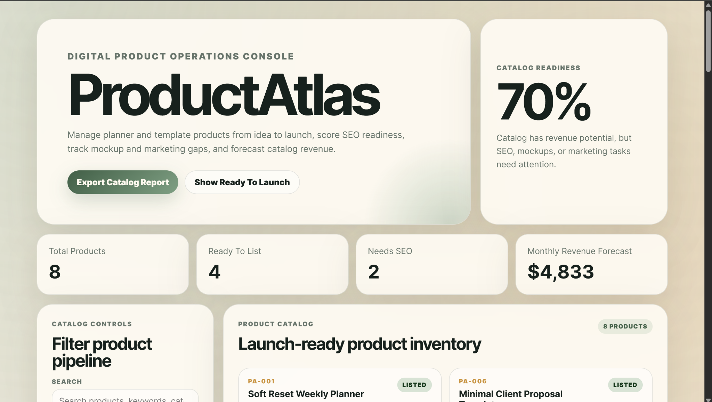
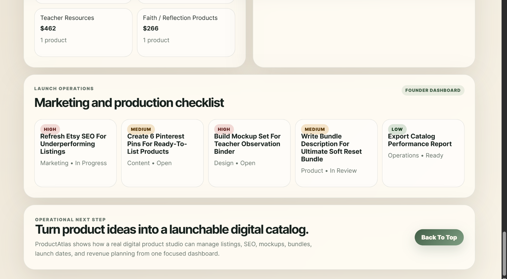

# ProductAtlas Digital Catalog & Launch Operations Dashboard

ProductAtlas is a polished digital product operations dashboard for managing planner, journal, template, and bundle products from idea to launch.

This project upgrades the original `Digital-Planner-Catalog-Dashboard` into a realistic internal business dashboard for a digital product studio. It tracks product status, launch readiness, SEO strength, mockup progress, marketing tasks, bundle opportunities, and monthly revenue forecasts.

## Project Preview

| Dashboard Overview | Launch Operations |
|---|---|
|  |  |

## Overview

ProductAtlas is designed for creators, Etsy sellers, template shops, and digital product studios that need a clear operational view of their product catalog.

Instead of only listing products, the dashboard answers practical launch questions:

- Which products are ready to list?
- Which products still need SEO work?
- Which products need mockups?
- Which products should be bundled?
- What is the monthly revenue forecast?
- Which launch tasks are blocking sales?

## Real-World Use Case

A digital product business often has many products in different stages: ideas, designs in progress, products needing mockups, products needing SEO, ready-to-list products, listed products, bundles, and products needing refresh.

ProductAtlas brings those workflows into one dashboard so a founder or operations team can decide what to work on next.

## Key Features

- Executive dashboard
- Product catalog cards
- Search and filters
- Category and status filters
- Launch readiness score
- SEO readiness score
- Mockup completion score
- Marketing readiness score
- Revenue forecast
- Launch pipeline view
- SEO gap analysis
- Bundle recommendation engine
- Marketing and production task board
- Product detail modal
- Exportable JSON catalog report
- Responsive SaaS-style interface
- GitHub Actions CI

## Dashboard Workflow

1. Review catalog readiness at the top of the page.
2. Filter products by category, status, or search keyword.
3. Open product detail cards to inspect readiness, SEO, mockups, and revenue forecast.
4. Review SEO gaps to see which listings need work.
5. Review bundle recommendations to improve average order value.
6. Use the task board to identify operational blockers.
7. Export the catalog report for documentation or planning.

## Tech Stack

- HTML
- CSS
- JavaScript
- Vite
- GitHub Actions

## Run Locally

```powershell
cd "C:\github-audit\Digital-Planner-Catalog-Dashboard"

npm install
npm run dev
```

Open:

```text
http://127.0.0.1:5173
```

## Build Locally

```powershell
npm run build
```

## Screenshot Gallery

Final screenshots are included in the `screenshots` folder.

Recommended screenshots:

| Screenshot | Suggested File Name |
|---|---|
| Dashboard overview | `dashboard-overview.png` |
| Product catalog | `product-catalog.png` |
| Product detail modal | `product-detail.png` |
| SEO and revenue sections | `seo-revenue-insights.png` |
| Launch task board | `launch-task-board.png` |

## Portfolio Value

ProductAtlas demonstrates product operations thinking, business dashboard design, revenue-aware product management, SEO and launch workflow logic, catalog filtering and scoring, clean frontend engineering, responsive UX design, and practical tool-building for digital businesses.

## Final Project Name

ProductAtlas Digital Catalog & Launch Operations Dashboard

